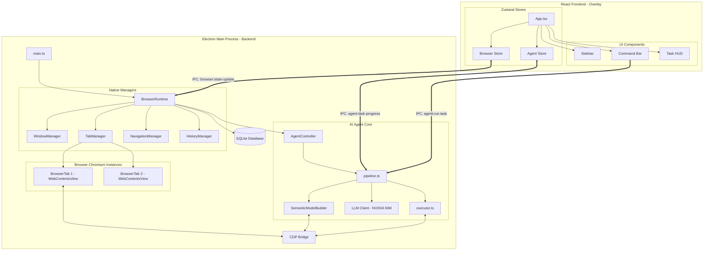

# Current Architecture

This document reflects the **actual runtime and process architecture** based on the forensic audit of the codebase.

## High-Level Process Model

The application uses Electron's multi-process architecture but structures it uniquely to support a translucent React overlay on top of native Chromium WebContents.

## Boundary Details

### 1. The Electron Main Process (`apps/browser-shell`)
This is the authoritative backend of the browser. It owns:
- The `BrowserWindow` framing the application.
- The `WebContentsView` instances that render actual web pages.
- The `CDPSession` (Chrome DevTools Protocol) attached to the active tab, used for DOM extraction and interaction.
- The SQLite database (`better-sqlite3`) for user profiles and memory.
- The AI execution logic (parsing, planning, executing).

### 1.a Native View Composition (Updated: 2026-08-08 20:36 IST)
The browser UI is natively composed using overlapping and adjacent `WebContentsView`s controlled by `WindowManager.ts`:
- **BrowserChromeView**: The top navigation and address bar (86px tall).
- **AIWorkspaceView**: The right-side collapsible agent UI (380px wide).
- **PageView**: The main browsing surface, precisely calculated to fill the remaining space between the chrome and the workspace.
- **DevTools**: We use pure, native Electron `openDevTools({ mode: 'right' })`. Because the `PageView` is natively bounded by the AIWorkspaceView on the right, Electron's internal engine seamlessly docks DevTools on the right side of the webpage without manually managing a `DevToolsView` or fighting with manual resize events.
- **OverlayView**: A full-window transparent overlay for floating UI elements like context menus or command bars.

### 2. The React Frontend Process (`apps/frontend`)
This is a pure UI overlay rendered with React, Vite, and Tailwind. It owns:
- The Sidebar, Command Bar, and Tabs UI.
- The visual presentation of AI execution progress.
- It **does not** render web content (e.g., no `<webview>` or `<iframe>` tags for browsing). The native `WebContentsView` from the Main Process sits underneath/beside it.

### 3. The CDP Bridge (`agent-core/cdp-bridge.ts`)
Because standard DOM manipulation from an Electron Main Process is limited, the application attaches a Chromium debugger (`CDPSession`) to the active `WebContentsView`. 
- **Read**: Extracts Accessibility Trees and runs JavaScript to evaluate page state.
- **Write**: Dispatches native mouse/keyboard events to simulate real user interactions.

## Data Flow: Agent Execution

1. **Trigger**: User types a command in the React UI (Command Bar).
2. **IPC Send**: React calls `window.electronAPI.runTask({ intent })`.
3. **Pipeline Start**: `agent-core/pipeline.ts` receives the intent.
4. **Parsing**: `semantic-model-builder.ts` uses CDP to extract the DOM and Accessibility Tree, compressing it into a `SemanticPageModel`.
5. **Planning**: `llm-client.ts` sends the compacted model + intent to the NVIDIA NIM API to generate a `TaskPlan`.
6. **Execution**: `executor.ts` iterates through the plan. It uses CDP to click, type, and navigate.
7. **Verification**: If an action is marked as destructive, `executor.ts` sends `agent:checkpoint-request` to the Frontend, waiting for the user to approve before continuing.
8. **Progress Updates**: Throughout the process, `agent:task-progress` IPC events are pushed to the Frontend, updating the `AgentStore` and rendering the HUD.
